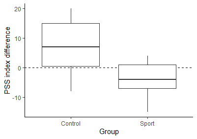
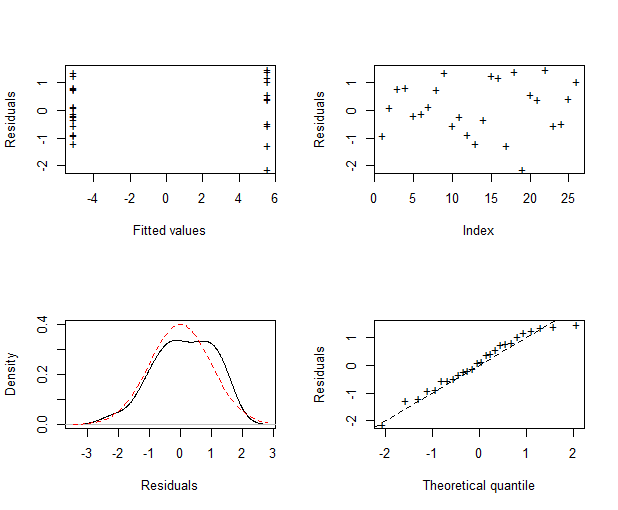
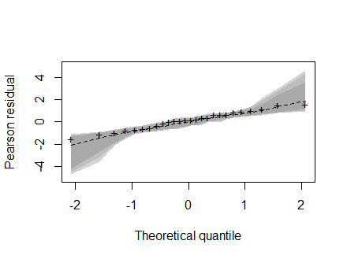
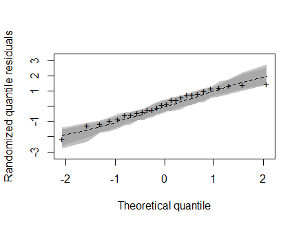

# `sdlrm`: Sdl Regression for Integer-Valued and Paired Count Data

[](https://travis-ci.com/travis-ci/travis-web)

> Rodrigo M. R. Medeiros
> <rodrigo.matheus@live.com>, IME-USP

Implementation of the SDL regression model proposed by Medeiros and Bourguignon (2020). Provide a set of functions for a complete analysis of integer-valued data, in which it is assumed that the dependent variable follows a Skew Discrete Laplace (SDL) distribution. This regression model is also useful for the analysis of experimental studies in which a paired count data is observed.

## Installation

You can install the current development version of `sdlrm` from [GitHub](https://github.com/rdmatheus/sdlrm) with:

``` r
devtools::install_github("rdmatheus/sdlrm")
```
To run the above command, it is necessary that the `devtools` package is previously installed on R. If not, install it using the following command:

``` r
install.packages("devtools")
```
After installing the devtools package, if you are using Windows, install the most current [RTools](https://cran.r-project.org/bin/windows/Rtools/) program. Finally, run the command `devtools::install_github("rdmatheus/sdlrm")`, and then the package will be installed on your computer.

## Example

This package provide complete estimation and inference for the parameters as well as simulation envelope plots, useful for assessing the goodness-of-fit of the model. The implementation is straightforward and similar to other popular packages, like `betareg` and `glm`, where the main function is `sdlrm()`. Below is an example of some functions usage and available methods.

``` r
library(sdlrm)

# Data visualization (Description: ?pss)
```




``` r
####################
# Mean model only  #
###################

# Fit model

fit <- sdlrm(Diff ~ Group, data = pss)

# Print

fit
#>
#> Call:
#> sdlrm(formula = Diff ~ Group, data = pss)
#> 
#> mu Coefficients:
#> [1]   5.573674 -10.718696
#> 
#> phi Coefficients:
#> [1] 10.57828

# Summary

summary(fit)
#>
#> Call:
#> sdlrm(formula = Diff ~ Group, data = pss)
#> 
#> Summary for residuals:
#>       Mean       Sd  Skewness Kurtosis
#>   0.121409 0.950138 -0.365905 2.272026
#> 
#> ----------------------------------------------------------------
#> Mean:
#> Coefficients:
#>             Estimate Std. Error t value  Pr(>|t|)   
#> (Intercept)   5.5737     2.4082  2.3145  0.020643 * 
#> GroupSport  -10.7187     3.5503 -3.0191  0.002535 **
#> ---
#> Signif. codes:  
#>   0 ‘***’ 0.001 ‘**’ 0.01 ‘*’ 0.05 ‘.’ 0.1 ‘ ’ 1
#> 
#> ----------------------------------------------------------------
#> Dispersion:
#> 
#> Link function: identity 
#> Coefficients:
#>     Estimate Std. Error t value  Pr(>|t|)
#> phi  10.5783     2.2493   4.703 2.564e-06***
#> ---
#> Signif. codes:  
#>   0 ‘***’ 0.001 ‘**’ 0.01 ‘*’ 0.05 ‘.’ 0.1 ‘ ’ 1
#> 
#> ----------------------------------------------------------------
#> In addition, Log-lik value: -89.51159 
#> AIC: 185.0232 and BIC: 188.7975

# Plot

plot(fit)
```


``` r
# Envelope

envel_sdl(fit)
```



