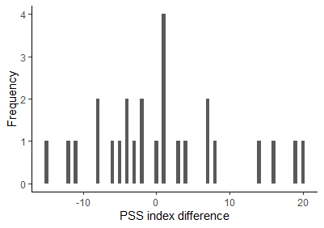
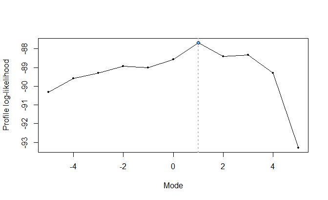
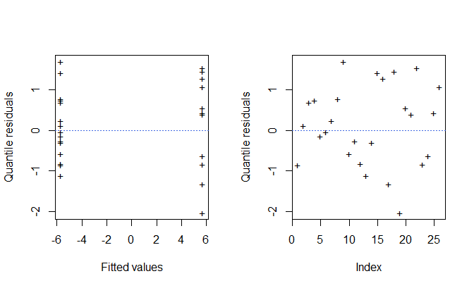
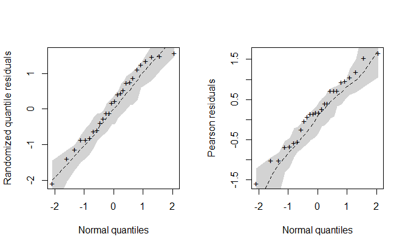

<!-- README.md is generated from README.Rmd. Please edit that file -->

# `sdlrm`: Modified SDL Regression for Integer-Valued and Paired Count Data

<!-- badges: start -->

[](https://github.com/rdmatheus/sdlrm/actions/workflows/R-CMD-check.yaml)
<!-- badges: end -->

> Rodrigo M. R. de Medeiros  
> Universidade Federal do Rio Grande do Norte, UFRN
> <rodrigo.matheus@ufrn.br>

Implementation of the modified SDL regression model proposed by Medeiros
and Bourguignon (2025). The `sdlrm` package provide a set of functions
for a complete analysis of integer-valued data, in which it is assumed
that the dependent variable follows a modified skew discrete Laplace
(SDL) distribution. This regression model is useful for the analysis of
integer-valued data and experimental studies in which paired discrete
observations are collected.

## Installation

You can install the current development version of `sdlrm` from
[GitHub](https://github.com/rdmatheus/sdlrm) with:

``` r
devtools::install_github("rdmatheus/sdlrm")
```

To run the above command, it is necessary that the `devtools` package is
previously installed on R. If not, install it using the following
command:

``` r
install.packages("devtools")
```

After installing the devtools package, if you are using Windows, install
the most current
[RTools](https://cran.r-project.org/bin/windows/Rtools/) program.
Finally, run the command `devtools::install_github("rdmatheus/sdlrm")`,
and then the package will be installed on your computer.

## Example

This package provide complete estimation and inference for the
parameters as well as normal probability plots of residuals with a
simulated envelope, useful for assessing the goodness-of-fit of the
model. The implementation is straightforward and similar to other
popular packages, like `betareg` and `glm`, where the main function is
`sdlrm()`. Below is an example of some functions usage and available
methods.

``` r
# Loading the sdlrm package
library(sdlrm)

# Data visualization (Description: ?pss)
```



``` r
# Fit a double model (mean and dispersion)
fit0 <- sdlrm(difference ~ group | group, data = pss)

# Print
fit0
#> 
#> Call:
#> sdlrm(formula = difference ~ group | group, data = pss)
#> 
#> Mean Coefficients:
#> (Intercept)  groupSport 
#>    7.363241  -11.296628 
#> 
#> Dispersion Coefficients:
#> (Intercept)  groupSport 
#>   2.6555857  -0.5875779 
#> 
#> ---
#> Log-lik value: -88.56555
#> Mode: 0
#> AIC: 187.1311 and BIC: 193.4216

# Summary
summary(fit0)
#> Call:
#> sdlrm(formula = difference ~ group | group, data = pss)
#> 
#> 
#> Summary for quantile residuals:
#>       Mean Std. dev.  Skewness Kurtosis
#>   0.003877  0.948567 -0.096418 1.839793
#> 
#> 
#> Mean coefficients:
#>             Estimate Std. Error z value Pr(>|z|)   
#> (Intercept)   7.3632     3.6010  2.0448 0.040874 * 
#> groupSport  -11.2966     4.0119 -2.8158 0.004865 **
#> ---
#> Signif. codes:  0 '***' 0.001 '**' 0.01 '*' 0.05 '.' 0.1 ' ' 1
#> 
#> 
#> Dispersion coefficients with log link:
#>             Estimate Std. Error z value Pr(>|z|)    
#> (Intercept)  2.65559    0.32089  8.2758   <2e-16 ***
#> groupSport  -0.58758    0.43006 -1.3663   0.1719    
#> ---
#> Signif. codes:  0 '***' 0.001 '**' 0.01 '*' 0.05 '.' 0.1 ' ' 1
#> 
#> ---
#> Log-lik value: -88.56555
#> Mode: 0
#> Pseudo-R2:0.1717017
#> AIC: 187.1311 and BIC: 193.4216
```

By default, the mode ($\xi$) of the modified SDL distribution is fixed
at $\xi = 0$. It is possible to specify a non-zero mode (it must be an
integer value) using the `xi` argument. Alternatively, this parameter
can be estimated via profile likelihood using the `choose_mode()`
function:

``` r
## Mode estimation via profile likelihood
mode_estimation <- choose_mode(fit0)
#> 
#> mode: -5 | logLik: -90.31 | AIC: 190.621 | BIC: 196.911
#> mode: -4 | logLik: -89.584 | AIC: 189.169 | BIC: 195.459
#> mode: -3 | logLik: -89.291 | AIC: 188.583 | BIC: 194.873
#> mode: -2 | logLik: -88.945 | AIC: 187.889 | BIC: 194.18
#> mode: -1 | logLik: -89.018 | AIC: 188.036 | BIC: 194.327
#> mode: 0 | logLik: -88.566 | AIC: 187.131 | BIC: 193.422
#> mode: 1 | logLik: -87.677 | AIC: 185.355 | BIC: 191.645
#> mode: 2 | logLik: -88.413 | AIC: 186.826 | BIC: 193.116
#> mode: 3 | logLik: -88.347 | AIC: 186.694 | BIC: 192.984
#> mode: 4 | logLik: -89.305 | AIC: 188.609 | BIC: 194.9
#> mode: 5 | logLik: -93.292 | AIC: 196.585 | BIC: 202.875
```



The `mode_estimation` object, of class `“choose_mode”`, consists of a
list whose elements represent a modified SDL regression fit for each
value specified for the mode (by default, the sequence
$-5, -4, \ldots, 4, 5$). We see that $\xi = 1$ generates the highest
profiled likelihood.

``` r
## Double model with xi = 1
fit1 <- mode_estimation[[1]]
```

The constant dispersion test in the modified SDL regression can be
performed with the `disp_test()` function:

``` r
## Test for constant dispersion
disp_test(fit1)
#>            Score   Wald Lik. Ratio Gradient
#> Statistic 2.2968 2.2289     2.2625   2.2669
#> p-Value   0.1296 0.1354     0.1325   0.1322
```

The tests do not reject the null hypothesis of constant dispersion. We
can then specify an adjustment with regressors only on the mean:

``` r
## Fit with constant dispersion and mode = 1
fit <- sdlrm(difference ~ group, data = pss, xi = 1)

## Summary
summary(fit)
#> Call:
#> sdlrm(formula = difference ~ group, data = pss, xi = 1)
#> 
#> 
#> Summary for quantile residuals:
#>       Mean Std. dev.  Skewness Kurtosis
#>   0.134617  0.982147 -0.282004 2.209202
#> 
#> 
#> Mean coefficients:
#>             Estimate Std. Error z value Pr(>|z|)   
#> (Intercept)   5.6976     2.3592  2.4150 0.015733 * 
#> groupSport  -11.3649     3.5272 -3.2221 0.001272 **
#> ---
#> Signif. codes:  0 '***' 0.001 '**' 0.01 '*' 0.05 '.' 0.1 ' ' 1
#> 
#> 
#> Dispersion coefficients with log link:
#>             Estimate Std. Error z value  Pr(>|z|)    
#> (Intercept)  2.33085    0.21283  10.952 < 2.2e-16 ***
#> ---
#> Signif. codes:  0 '***' 0.001 '**' 0.01 '*' 0.05 '.' 0.1 ' ' 1
#> 
#> ---
#> Log-lik value: -88.8298
#> Mode: 1
#> Pseudo-R2:0.3378125
#> AIC: 185.6596 and BIC: 190.692
```

Currently, the methods implemented for `"sdlrm"` objects are

``` r
methods(class = "sdlrm")
#>  [1] AIC          coef         logLik       model.frame  model.matrix
#>  [6] plot         predict      print        residuals    summary     
#> [11] vcov        
#> see '?methods' for accessing help and source code
```

The `plot()` method provides diagnostic plots of the residuals. By
default, randomized quantile residuals are used:

``` r
par(mfrow = c(1, 2))
plot(fit, ask = FALSE)
```



``` r
par(mfrow = c(1, 1))
```

The `envelope()` function plots the normal probability of the residuals
with a simulated envelope:

``` r
## Building the envelope plot
envel <- envelope(fit, plot = FALSE)
#>   |                                                                              |                                                                      |   0%  |                                                                              |=                                                                     |   1%  |                                                                              |=                                                                     |   2%  |                                                                              |==                                                                    |   3%  |                                                                              |===                                                                   |   4%  |                                                                              |====                                                                  |   5%  |                                                                              |====                                                                  |   6%  |                                                                              |=====                                                                 |   7%  |                                                                              |======                                                                |   8%  |                                                                              |======                                                                |   9%  |                                                                              |=======                                                               |  10%  |                                                                              |========                                                              |  11%  |                                                                              |=========                                                             |  12%  |                                                                              |=========                                                             |  13%  |                                                                              |==========                                                            |  14%  |                                                                              |===========                                                           |  15%  |                                                                              |===========                                                           |  16%  |                                                                              |============                                                          |  17%  |                                                                              |=============                                                         |  18%  |                                                                              |==============                                                        |  19%  |                                                                              |==============                                                        |  20%  |                                                                              |===============                                                       |  21%  |                                                                              |================                                                      |  22%  |                                                                              |================                                                      |  23%  |                                                                              |=================                                                     |  24%  |                                                                              |==================                                                    |  26%  |                                                                              |===================                                                   |  27%  |                                                                              |===================                                                   |  28%  |                                                                              |====================                                                  |  29%  |                                                                              |=====================                                                 |  30%  |                                                                              |=====================                                                 |  31%  |                                                                              |======================                                                |  32%  |                                                                              |=======================                                               |  33%  |                                                                              |========================                                              |  34%  |                                                                              |========================                                              |  35%  |                                                                              |=========================                                             |  36%  |                                                                              |==========================                                            |  37%  |                                                                              |==========================                                            |  38%  |                                                                              |===========================                                           |  39%  |                                                                              |============================                                          |  40%  |                                                                              |=============================                                         |  41%  |                                                                              |=============================                                         |  42%  |                                                                              |==============================                                        |  43%  |                                                                              |===============================                                       |  44%  |                                                                              |===============================                                       |  45%  |                                                                              |================================                                      |  46%  |                                                                              |=================================                                     |  47%  |                                                                              |==================================                                    |  48%  |                                                                              |==================================                                    |  49%  |                                                                              |===================================                                   |  50%  |                                                                              |====================================                                  |  51%  |                                                                              |====================================                                  |  52%  |                                                                              |=====================================                                 |  53%  |                                                                              |======================================                                |  54%  |                                                                              |=======================================                               |  55%  |                                                                              |=======================================                               |  56%  |                                                                              |========================================                              |  57%  |                                                                              |=========================================                             |  58%  |                                                                              |=========================================                             |  59%  |                                                                              |==========================================                            |  60%  |                                                                              |===========================================                           |  61%  |                                                                              |============================================                          |  62%  |                                                                              |============================================                          |  63%  |                                                                              |=============================================                         |  64%  |                                                                              |==============================================                        |  65%  |                                                                              |==============================================                        |  66%  |                                                                              |===============================================                       |  67%  |                                                                              |================================================                      |  68%  |                                                                              |=================================================                     |  69%  |                                                                              |=================================================                     |  70%  |                                                                              |==================================================                    |  71%  |                                                                              |===================================================                   |  72%  |                                                                              |===================================================                   |  73%  |                                                                              |====================================================                  |  74%  |                                                                              |=====================================================                 |  76%  |                                                                              |======================================================                |  77%  |                                                                              |======================================================                |  78%  |                                                                              |=======================================================               |  79%  |                                                                              |========================================================              |  80%  |                                                                              |========================================================              |  81%  |                                                                              |=========================================================             |  82%  |                                                                              |==========================================================            |  83%  |                                                                              |===========================================================           |  84%  |                                                                              |===========================================================           |  85%  |                                                                              |============================================================          |  86%  |                                                                              |=============================================================         |  87%  |                                                                              |=============================================================         |  88%  |                                                                              |==============================================================        |  89%  |                                                                              |===============================================================       |  90%  |                                                                              |================================================================      |  91%  |                                                                              |================================================================      |  92%  |                                                                              |=================================================================     |  93%  |                                                                              |==================================================================    |  94%  |                                                                              |==================================================================    |  95%  |                                                                              |===================================================================   |  96%  |                                                                              |====================================================================  |  97%  |                                                                              |===================================================================== |  98%  |                                                                              |===================================================================== |  99%  |                                                                              |======================================================================| 100%

par(mfrow = c(1, 2))
# Plot for the randomized quantile residuals (default)
plot(envel)

# Plot for the Pearson residuals
plot(envel, type = "pearson")
```



``` r
par(mfrow = c(1, 1))
```
